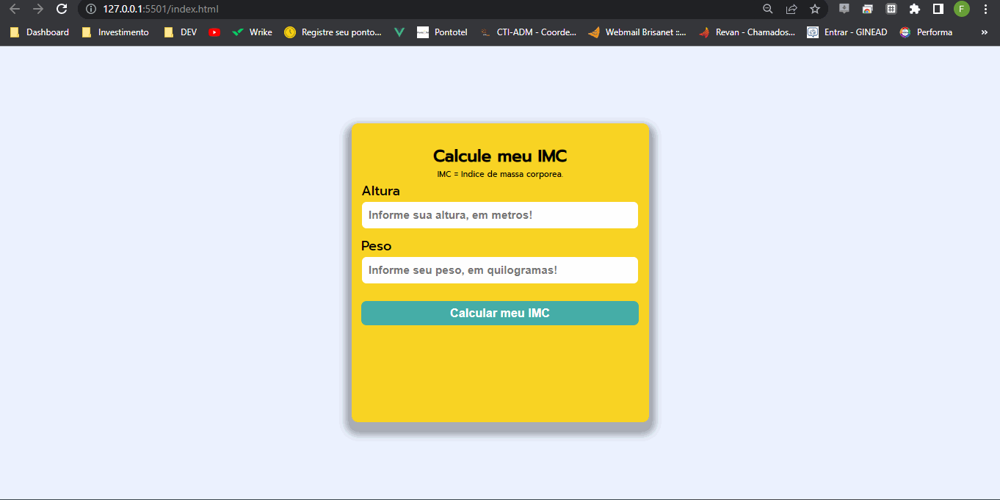

<h1 align="center"> Calculadora IMC </h1>

Uma simples (porém funcional) calculadora de IMC feita com JavaScript.

  

## 🚀 Tecnologias

Este projeto foi desenvolvido usando as seguintes tecnologias:

- HTML
- CSS
- JavaScript

## 💻 Projeto

Este projeto consiste em calcular o IMC de qualquer pessoa. Após o usuário inserir a sua altura e seu peso, a ferramenta irá lhe informar o resultado do IMC.

## 🔗 Redes

Ainda não me segue? Aqui estão minhas redes sociais. Caso queiram falar comigo, é só chamar! ;).

- [Linkedin](https://www.linkedin.com/in/farley-lima-a364a4122/)
- [Instagram](https://www.instagram.com/farley.lima.18)
- [twitch](https://www.twitch.tv/fl12_silva)
